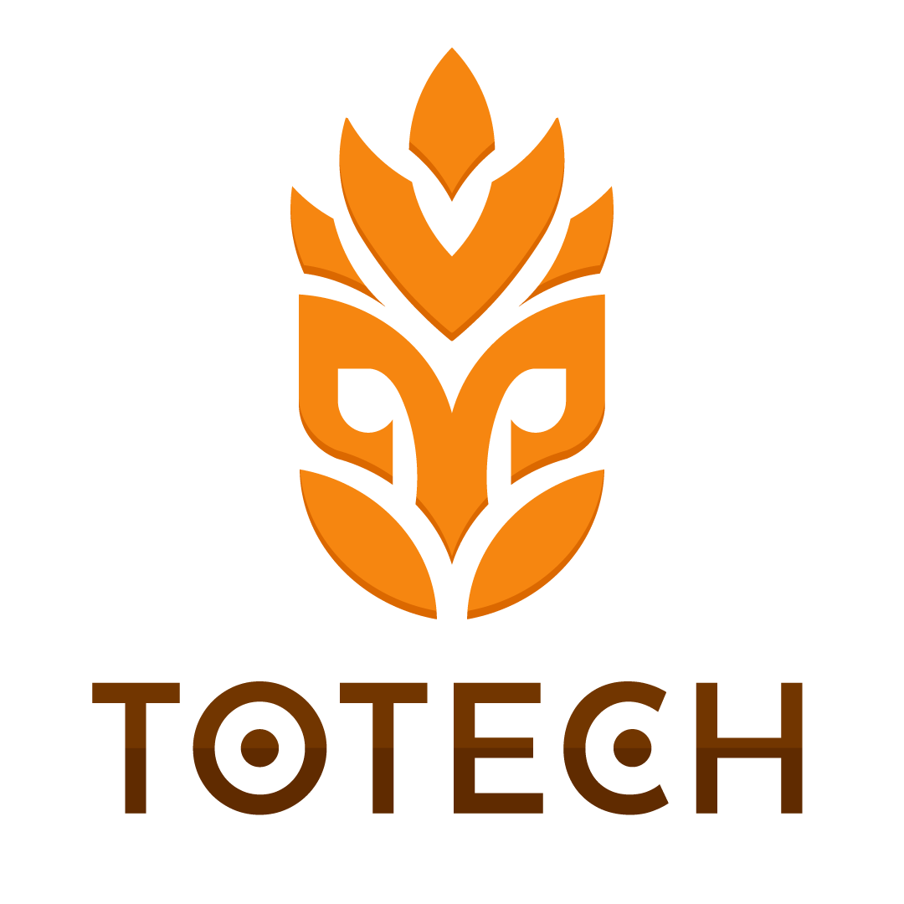

# 🌾 SmartFarm Dashboard by Totech

**March 2025 Innovate-a-thon: Improving the Tomato Supply Chain**  
🏆 _Totech 4-Stage Smart Farming System – “Scalable Innovation for Smarter Farms”_

SmartFarm is a Streamlit-based interactive platform developed for the Innovate-a-thon competition to revolutionize the tomato supply chain through affordable, modular smart farming technologies.

---

## 🚀 Totech 4-Stage Smart Farming System

A progressive adoption plan designed for small and medium-sized farms to evolve from simple monitoring to full automation:

### 🌱 Stage 1: Smart Monitoring & Data Insights
- **Deploys IoT sensors** for soil moisture, temperature, and environment.
- **Live dashboard** visualizes farm conditions through an intuitive HMI.

**Quick Wins:**
- ✅ Save up to 20% on water by preventing over-irrigation.
- ✅ Cut chemical waste with precise soil insight.
- ✅ Instant alerts to prevent crop stress.

### 💧 Stage 2: Intelligent Automation & Climate Control
- **Automated irrigation** and climate responses based on sensor data.

**Quick Wins:**
- ✅ Save up to 50% on water.
- ✅ Reduce manual labor and increase yield consistency.

### 🤖 Stage 3: Smart Machines & Advanced Automation
- **Autonomous machines** for planting, weeding, and harvesting.

**Quick Wins:**
- ✅ Cut labor costs up to 40%.
- ✅ Reduce herbicide use by 60%.
- ✅ Enable 24/7 farming with machine-driven workflows.

### 📊 Stage 4: AI-Powered Predictive Farming & Supply Chain Integration
- **AI & ML forecasting**, disease detection, and smart harvest scheduling.
- **Data network integration** for market access and optimized logistics.

**Quick Wins:**
- ✅ Boost yields up to 20% with AI-driven strategy.
- ✅ Detect diseases early.
- ✅ Improve profits with optimized harvest timing.

---

## 🔍 Project Features

- 🧠 **Dashboard Overview**: Real-time insights from IoT devices with intuitive visualization.
- 🗺️ **Field Map**: Interactive sensor-level map with color-coded soil/environment data.
- 📍 **Zone Detail View**: Per-zone sensor stats and health indicators.
- 📈 **Analytics & Trends**: Historical zone comparisons and trend analysis.
- 📅 **Calendar View**: 
  - Pre-filled irrigation, tank, and crop events
  - Weather forecasts via OpenWeather API
- 🔐 **Secure Login**: Basic credential-based access using Streamlit Secrets.
- 📡 **Live WebSocket Streaming**: Simulates real-time IoT data updates.
- 🧱 **Modular Architecture**: Easily extend and scale with additional components.

---

## 🛠️ Setup Instructions

### 1. Clone the Repository
```bash
git clone https://github.com/yourusername/smartfarm-app.git
cd smartfarm-app
```

### 2. Install Requirements
```bash
pip install -r requirements.txt
```

### 3. Configure Secrets
Create a `.streamlit/secrets.toml` file:

```toml
[credentials]
username = "your_user"
password = "your_password"

[api]
OPENWEATHER_API_KEY = "your_openweather_api_key"
```

### 4. Run the Mock WebSocket Server (for testing)
```bash
python mock_ws_server.py
```

### 5. Launch the SmartFarm App
```bash
streamlit run Home.py
```

---

## 📁 Folder Structure

```
📦 smartfarm-app/
├── Home.py
├── mock_ws_server.py
├── pages/
├── components/
├── utils/
├── static/
├── requirements.txt
└── README.md
```

---

## 🧠 Why Choose Totech?

- ✅ **Scalable Adoption** – Start simple, grow smart
- ✅ **Affordable** – ROI-focused, step-by-step integration
- ✅ **Data-Driven** – Real-time actionable insights
- ✅ **Future-Proof** – Built for long-term success

---

## 🤝 Join the Agri-Tech Revolution

Start your journey with **Stage 1** and grow into the smart farm of the future.  
🚀🚜🌱

---

## 👥 Team Totech – Innovate-a-thon 2025

Built with passion by:

<table>
  <tr>
    <td align="center">
      <br>
      <b>Oliver MacDonald</b><br>Product Design & Financial Analysis
    </td>
    <td align="center">
      <br>
      <b>Makeña Verdugo</b><br>Development & Research Planning
    </td>
    <td align="center">
      <br>
      <b>Paridha Talmale</b><br>Business Analysis & Ideation
    </td>
  </tr>
</table>

---

## 🖼 Logo

<p align="center">
  
</p>

Made for Innovate-a-thon March 2025 Competition.